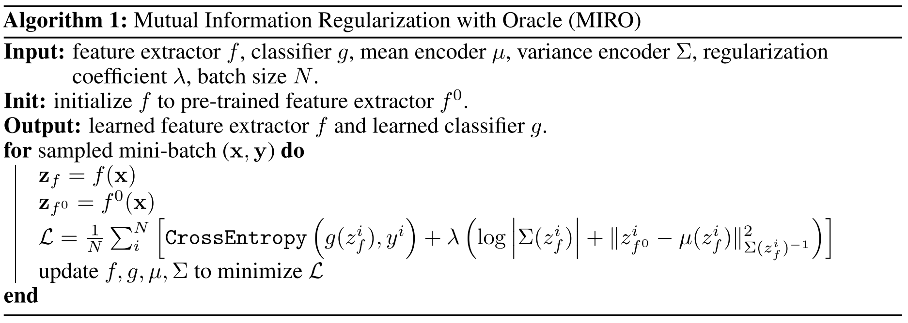
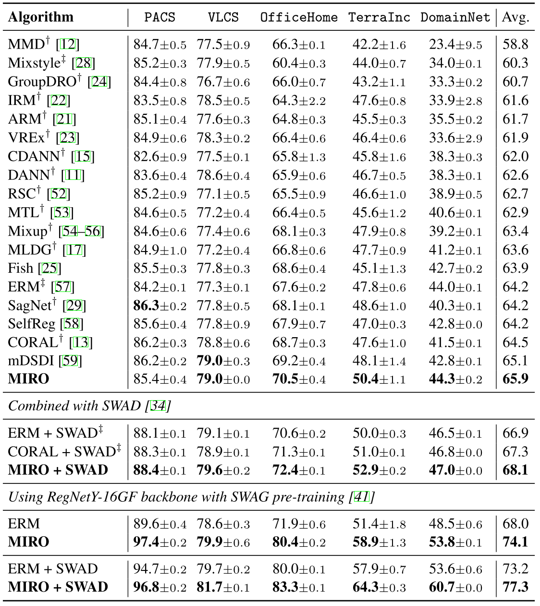

# MIRO: Mutual Information Regularization with Oracle (ECCV'22)

Official PyTorch implementation of [Domain Generalization by Mutual-Information Regularization with Pre-trained Models](https://arxiv.org/abs/2203.10789).

Junbum Cha, Kyungjae Lee, Sungrae Park, Sanghyuk Chun.

<p align="center">
    
</p>


## Preparation

### Dependencies

```sh
pip install -r requirements.txt
```

### Datasets

```sh
python -m domainbed.scripts.download --data_dir=/my/datasets/path
```

### Environments

Environment details used for the main experiments. Every main experiment is conducted on a single NVIDIA V100 GPU.

```
Environment:
	Python: 3.7.7
	PyTorch: 1.7.1
	Torchvision: 0.8.2
	CUDA: 10.1
	CUDNN: 7603
	NumPy: 1.21.4
	PIL: 7.2.0
```

## How to Run

`train_all.py` script conducts multiple leave-one-out cross-validations for all target domain.

```sh
python train_all.py exp_name --dataset PACS --data_dir /my/dataset/path --algorithm MIRO
```


### Main experiments

Run command with hyperparameters (HPs):

```sh
python train_all.py exp_name --data_dir /my/dataset/path --algorithm MIRO \
    --dataset PACS \
    --lr 3e-5 \
    --resnet_dropout 0.0 \
    --weight_decay 0.0 \
    --ld 0.01 \
    --trial_seed 0
```

Our searched HPs:

|               | PACS | VLCS | OfficeHome | TerraIncognita | DomainNet |
| ------------- | ---- | ---- | ---------- | -------------- | --------- |
| Learning rate | 3e-5 | 1e-5 | 3e-5       | 3e-5           | 3e-5      |
| Dropout       | 0.0  | 0.5  | 0.1        | 0.0            | 0.1       |
| Weight decay  | 0.0  | 1e-6 | 1e-6       | 1e-4           | 0.0       |
| $\lambda$     | 0.01 | 0.01 | 0.1        | 0.1            | 0.1       |


### Combination with SWAD

Set `--swad True` to combine with [SWAD](https://arxiv.org/abs/2102.08604).

```sh
python train_all.py exp_name --data_dir /my/dataset/path --algorithm MIRO \
    --dataset PACS \
    --ld 0.01 \
    --swad True \
    --trial_seed 0
```


### Experiments with various backbones

You can run MIRO with different backbones via `--model` parameter:

```sh
# model is one of [resnet50, resnet50_barlowtwins, resnet50_moco, clip_resnet50, clip_vit-b16, swag_regnety_16gf]
python train_all.py exp_name --data_dir /my/dataset/path --algorithm MIRO \
    --dataset PACS --model resnet50
```

The checkpoint should be prepared before run [MoCo v3](https://github.com/facebookresearch/moco-v3) (`resnet50_moco`). 
You can download [ResNet-50 MoCo v3 on 1000 epochs here](https://dl.fbaipublicfiles.com/moco-v3/r-50-1000ep/r-50-1000ep.pth.tar).


## Reproduce the main results of the paper

We provide the commands to reproduce the main results of the paper (Table 1).
Note that every result is averaged over three trials; use `trial_seed` option as 0, 1, 2 and average the results.

<details>
<summary> Main experiment (<b>65.9%</b> by MIRO) </summary>

```sh
python train_all.py PACS --data_dir /my/dataset/path --algorithm MIRO --dataset PACS --lr 3e-5 --resnet_dropout 0.0 --weight_decay 0.0 --ld 0.01
python train_all.py VLCS --data_dir /my/dataset/path --algorithm MIRO --dataset VLCS --lr 1e-5 --resnet_dropout 0.5 --weight_decay 1e-6 --ld 0.01
python train_all.py OfficeHome --data_dir /my/dataset/path --algorithm MIRO --dataset OfficeHome --lr 3e-5 --resnet_dropout 0.1 --weight_decay 1e-6 --ld 0.1
python train_all.py TerraIncognita --data_dir /my/dataset/path --algorithm MIRO --dataset TerraIncognita --lr 3e-5 --resnet_dropout 0.0 --weight_decay 1e-4 --ld 0.1
python train_all.py DomainNet --data_dir /my/dataset/path --algorithm MIRO --dataset DomainNet --lr 3e-5 --resnet_dropout 0.1 --weight_decay 0.0 --ld 0.1
```

</details>

<details>
<summary> Combination with SWAD (<b>68.1%</b> by MIRO + SWAD) </summary>

```sh
python train_all.py PACS --data_dir /my/dataset/path --algorithm MIRO --dataset PACS --ld 0.01 --swad True
python train_all.py VLCS --data_dir /my/dataset/path --algorithm MIRO --dataset VLCS --ld 0.01 --checkpoint_freq 50 --tolerance_ratio 0.2 --swad True
python train_all.py OfficeHome --data_dir /my/dataset/path --algorithm MIRO --dataset OfficeHome --ld 0.1 --swad True
python train_all.py TerraIncognita --data_dir /my/dataset/path --algorithm MIRO --dataset TerraIncognita --ld 0.1 --swad True
python train_all.py DomainNet --data_dir /my/dataset/path --algorithm MIRO --dataset DomainNet --ld 0.1 --checkpoint_freq 500 --swad True
```

</details>

<details>
<summary> Pushing the limits (<b>77.3%</b> by MIRO + SWAD + SWAG) </summary>

```sh
python train_all.py PACS --data_dir /my/dataset/path --algorithm MIRO --dataset PACS --ld 0.01 --model swag_regnety_16gf --batch_size 16 --swad True
python train_all.py VLCS --data_dir /my/dataset/path --algorithm MIRO --dataset VLCS --ld 0.01 --checkpoint_freq 50 --tolerance_ratio 0.2 --model swag_regnety_16gf --batch_size 16 --swad True
python train_all.py OfficeHome --data_dir /my/dataset/path --algorithm MIRO --dataset OfficeHome --ld 0.01 --model swag_regnety_16gf --batch_size 16 --swad True
python train_all.py TerraIncognita --data_dir /my/dataset/path --algorithm MIRO --dataset TerraIncognita --ld 0.01 --model swag_regnety_16gf --batch_size 16 --swad True
python train_all.py DomainNet --data_dir /my/dataset/path --algorithm MIRO --dataset DomainNet --ld 0.1 --checkpoint_freq 500 --model swag_regnety_16gf --batch_size 16 --swad True
```

</details>

<details>
<summary> Searched $\lambda$ of various pre-training methods </summary>

| | PACS | VLCS | OfficeHome | TerraIncognita | DomainNet |
| - | - | - | - | - | - |
| Barlow twins  | 0.001 | 0.01 | 0.1 | 0.01 | 0.01 |
| MoCo v3       | 0.001 | 0.01 | 0.1 | 0.01 | 0.01 |
| CLIP (ResNet) | 0.1 | 1.0 | 1.0 | 1.0 | 0.1 |
| CLIP (ViT)    | 1.0 | 1.0 | 1.0 | 1.0 | 1.0 |
| SWAG (RegNet) | 0.1 | 0.01 | 0.1 | 0.01 | 0.1 |

</details>


## Main Results

<p align="center">
    
</p>

### Additional results

| | PACS | VLCS | OfficeHome | TerraIncognita | DomainNet | Avg. |
| - | - | - | - | - | - | - |
| MIRO + SWAD (B=16) | 96.8 | 81.7 | 83.3 | 64.3 | 60.7 |  77.3 |
| MIRO + SWAD (B=32) | 97.5 | 81.6 | 84.2 | 65.5 | 60.8 |  77.9 |

In **pushing the limits** experiments of the paper, we use the batch size of 16 due to the limitation of computational resources.
Afterwards, we find that the batch size of 32 improves the overall performance as shown in this table. 
Note that this experiments tune $\lambda$ only, so there is room for further performance improvement by intensive HP tuning.


## Citation

```
@article{cha2022miro,
  title={Domain Generalization by Mutual-Information Regularization with Pre-trained Models},
  author={Junbum Cha and Kyungjae Lee and Sungrae Park and Sanghyuk Chun},
  journal={European Conference on Computer Vision (ECCV)},
  year={2022}
}
```


## License

This project is released under the MIT license, included [here](./LICENSE).

This project include some code from [facebookresearch/DomainBed](https://github.com/facebookresearch/DomainBed) (MIT license) and
[khanrc/swad](https://github.com/khanrc/swad) (MIT license).
